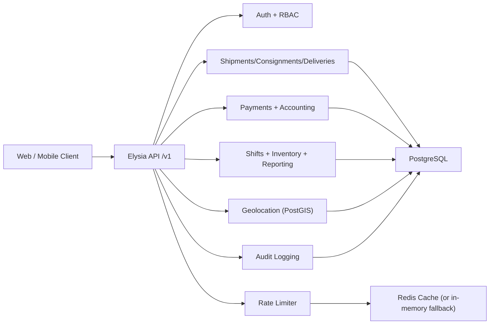
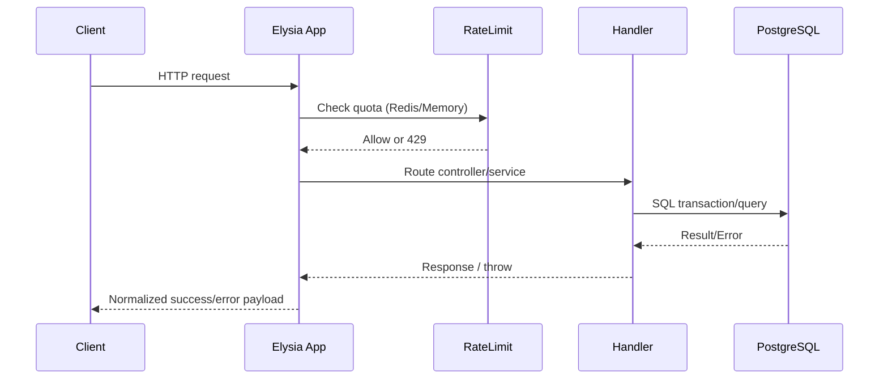

# VIPEX Backend Architecture

## Overview

The backend is a modular monolith built on Bun + Elysia + Drizzle + PostgreSQL.
Modules are isolated by feature folders and share infrastructure plugins for auth, error handling, logging, rate limiting, and observability.

## Runtime Components

## Request Lifecycle

## Design Rules

- Use `HttpStatus` constants (no hardcoded numbers).
- Use shared ID schema in `/src/server/schemas/common.ts` for all ID validation.
- Return normalized errors through `/src/server/middlewares/error-handler.ts`.
- Keep business logic in services, not in route definitions.

## Accounting Model

The accounting module is a controlled ledger layer over operations.

- Branch is the primary accounting owner for every entry.
- Location is an optional sub-dimension.
- Operational activity is not automatically the general ledger.
- Confirmed or approved accounting events post to journals.
- Reporting reads from posted journal lines.
- Accounting is optional per company and is controlled through the company module system.
- The current UI control point is `/settings/company`, which toggles the `accounting` module and keeps `companies.use_accounting` synchronized for auth and navigation gating.
- Accounting master data maintenance is exposed at `/accounting/setup` for chart of accounts, expense categories, approval policies, company bank accounts, tax profiles, and tax components.
- Accounting access is also role-gated through dedicated permission keys for viewing, setup management, tax filing, and posting workflows.
- Accounting setup mutations are audit-logged with actor and before/after metadata through the shared audit module.
- Accounting setup also surfaces entity-level audit history inline, so finance admins do not need to leave `/accounting/setup` to review record changes.
- Chart-of-accounts deletion is supported only for accounts with no journal usage, setup mappings, petty cash linkage, or child accounts.

Reference: `docs/ACCOUNTING_MODULE.md`

## HR and Payroll

HR and Payroll are implemented as company-scoped modules layered onto the modular monolith.

- Module enablement is controlled through `company_modules`.
- Every HR/Payroll route requires both permission and module access.
- HR owns employees, departments, job titles, attendance, and employee identity.
- Users remain the authentication/access layer and may optionally link to an employee.
- Payroll depends on HR and uses separate transactional tables for periods, runs, run items, and payslips.

Reference: `docs/HR_PAYROLL_FOUNDATION.md`

## Reporting

Reporting is implemented as a shared read-model layer over the domain modules.

- `/v1/reports/*` endpoints aggregate HR, payroll, customer, parcel, and cashier data.
- Accounting retains its dedicated financial report endpoints under `/v1/accounting/reports/*`.
- The web UI entry point for cross-module operational reporting is `/reports`.
- Printable reports use a shared letterhead-friendly React print document built with `react-to-print`.
- New reports should reuse the shared report page, export, and print patterns before adding one-off screens.

Reference: `docs/REPORTING_MODULE.md`

## Company Module Control

The application supports company-scoped module enablement through:

- `module_catalog`
- `company_modules`

Current UI entry point:

- `/settings/company`

Current backend entry point:

- `/v1/company-modules`

Reference: `docs/COMPANY_MODULES.md`

## Parcel Internal Custody

Parcel internal custody is modeled separately from shipment status.

- Warehouses are branch-owned master records.
- Internal transfers can move parcels between branch, location, and warehouse holders within a branch.
- Transfers are tracked independently from parcel status.
- Acknowledgement is the event that updates current internal holder state.
- Pending transfers prevent the same parcel from being queued into another internal transfer until the move is resolved.

Reference: `docs/PARCEL_INTERNAL_TRANSFERS.md`

## Shared Upload Storage

Uploads are implemented as a shared platform resource instead of feature-specific file tables.

- Binary files are stored in MinIO through a single upload service.
- Metadata is stored in the shared `uploads` table with `modelType` and `modelId`.
- Features keep their own business fields for the active image URL when needed, for example:
  - `employees.profile_image_url`
  - `customer_cards.front_image_url`
  - `customer_cards.back_image_url`
- The same upload API now supports rider signatures, employee profile photos, and customer card images without duplicating storage logic.
- Uploaded objects are served back through the app proxy route instead of exposing raw bucket paths directly.
