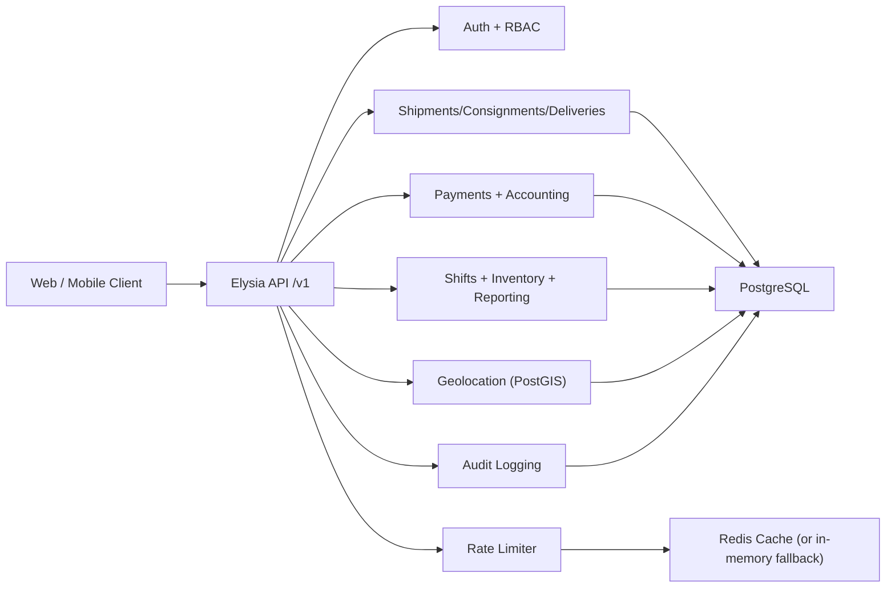
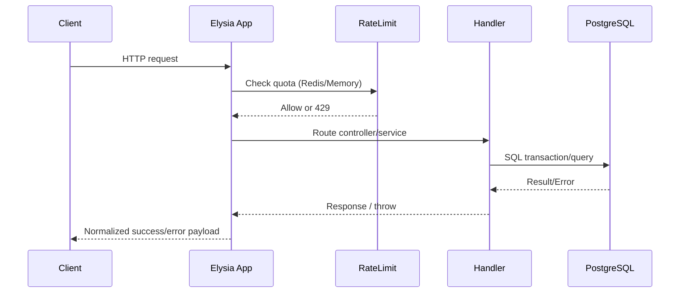

# VIPEX Backend Architecture

## Overview
The backend is a modular monolith built on Bun + Elysia + Drizzle + PostgreSQL.
Modules are isolated by feature folders and share infrastructure plugins for auth, error handling, logging, rate limiting, and observability.

## Runtime Components

## Request Lifecycle

## Design Rules
- Use `HttpStatus` constants (no hardcoded numbers).
- Use shared ID schema in `/src/server/schemas/common.ts` for all ID validation.
- Return normalized errors through `/src/server/middlewares/error-handler.ts`.
- Keep business logic in services, not in route definitions.
